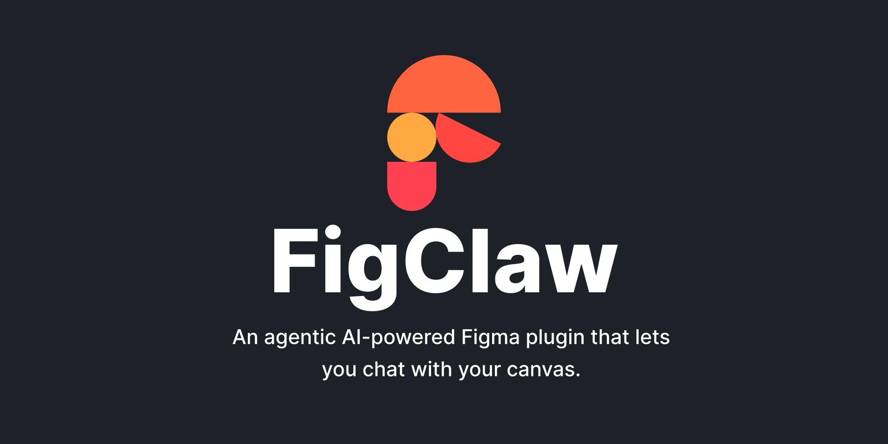

# FigClaw

> Available on the [Figma Community](https://www.figma.com/community/plugin/1610744892832367485/figclaw)

FigClaw is an agentic Claude-powered Figma plugin that lets you chat with your canvas, inspect and manipulate nodes, and execute Figma Plugin API code — all from within Figma.

Instead of a simple Q&A chat, FigClaw runs an agent loop: it inspects your current selection, reads the page structure, looks up Figma Plugin API docs on demand, writes and executes JavaScript against the `figma` global, and reports back what changed — all in one conversation turn.

## Motivation

Figma's Plugin API is powerful, but writing plugins can be a chore — especially for quick one-off automations. With FigClaw, you can skip the boilerplate and just tell Claude what you want to do with your canvas in natural language. It's like having a coding assistant built right into Figma.

## Features

- **Agentic loop** — Claude autonomously calls tools, reads results, and iterates until the task is done
- **Canvas inspection** — read the current selection or the full page node tree
- **Generated code execution** — Claude writes arbitrary Figma Plugin API code and immediately executes it in the plugin sandbox (full `await` support)
- **Doc lookup** — fetches Figma API docs on demand so Claude always has the right signatures
- **Skills** — load custom `.md` instruction files that extend Claude's behaviour (e.g. enforce naming conventions, apply accessibility rules, build components a certain way)
- **In-plugin skill authoring** — create and update skills directly from chat inside the plugin
- **Skill modes** — set each custom skill to `active` (always on) or `passive` (invoked only when mentioned)
- **Image attachments** — attach screenshots or reference images to any message
- **Chat history** — conversations are saved across sessions and can be resumed or deleted
- **Persistent API key** — stored locally via `figma.clientStorage`, never leaves your machine

## How it works

1. You type a message (and optionally attach images) in the **Chat** tab.
2. FigClaw sends your message plus the full conversation history to the Claude API directly from the plugin iframe.
3. Claude decides which tools to call. The plugin executes them and returns results.
4. This loop repeats until Claude stops using tools and sends a final reply.

### Tools Claude can use

The toolset is intentionally small. Rather than exposing a specific tool for every possible Figma operation, `run_figma_code` acts as a universal escape hatch — Claude writes and executes arbitrary JavaScript with full access to the `figma` global. The dedicated read tools exist purely for convenience, since reading canvas state is the most frequent operation and doesn't require writing code.

| Tool             | Description                                                                                                                                                                                    |
| ---------------- | ---------------------------------------------------------------------------------------------------------------------------------------------------------------------------------------------- |
| `run_figma_code` | Executes arbitrary JavaScript in the Figma plugin sandbox — full access to the `figma` global and top-level `await`. Handles all writes and any operation not covered by the read tools below. |
| `get_selection`  | Returns the currently selected nodes with all serialised properties                                                                                                                            |
| `get_page_nodes` | Returns nodes on the current page up to a configurable depth                                                                                                                                   |
| `get_node_by_id` | Returns a specific node by its Figma ID                                                                                                                                                        |
| `get_styles`     | Lists all local paint, text, effect, and grid styles                                                                                                                                           |
| `get_variables`  | Returns all local variable collections, modes, and resolved values — use before any design token work                                                                                          |
| `get_components` | Lists all components and component sets on the current page                                                                                                                                    |
| `get_pages`      | Lists all pages in the document with their id, name, and child node count                                                                                                                      |
| `notify`         | Shows a toast notification inside Figma                                                                                                                                                        |
| `download_files` | Triggers a file download in the user's browser — use for exporting SVGs, PNGs, or any other binary/text data to disk                                                                           |
| `fetch_docs`     | Fetches a Figma Plugin API reference page on demand so Claude always has the right signatures                                                                                                  |
| `create_skill`   | Creates a new skill document and saves it to the plugin — Claude can write skills from scratch based on your instructions                                                                      |
| `update_skill`   | Updates the name and/or content of an existing loaded skill — ask Claude to refine a skill and it will persist the changes immediately                                                         |

## Skills

Skills are Markdown files that get injected into Claude's system prompt, giving it extra domain knowledge or behavioural rules for a session.

Each custom skill has a mode:

- **Active** — always-on. The skill is injected into every conversation turn as persistent behaviour.
- **Passive** — on-demand. The skill is ignored unless you explicitly call it with an `@mention` in your message.

You can toggle a skill's mode from the **Skills** tab by clicking its mode badge (`active` / `passive`).

Claude can manage skills directly during a conversation:

- **Create** — _"Create a skill for how I like to name layers"_ → Claude writes the markdown and saves it as a new skill.
- **Update** — _"Update the naming-conventions skill to also cover component variants"_ → Claude edits the skill content in place.

You can also upload your own `.md` files manually from the **Skills** tab.

### Calling passive skills

Passive skills are invoked with `@skill-name` in the chat composer.

- Type `@` in the message box to open skill autocomplete.
- Pick the skill (or type its full name) and send your message.
- The mention token is removed before execution, and that skill's content is injected only for that request.

Example:

- `@design-tokens Create color variables for light and dark mode.`

The repository ships with several example skills in the `skills/` folder:

| Skill                   | Description                                                                     |
| ----------------------- | ------------------------------------------------------------------------------- |
| `accessibility.md`      | WCAG contrast checking and accessibility annotations                            |
| `component-builder.md`  | Patterns for building production-ready components with variants and auto-layout |
| `design-tokens.md`      | Creating and applying Figma Variables as design tokens                          |
| `icon-exporter.md`      | Batch-exporting icons with consistent naming                                    |
| `naming-conventions.md` | Enforcing layer naming rules                                                    |
| `everything-is-pink.md` | Makes everything pink (demo)                                                    |
| `overly-cautious.md`    | Claude adds excessive warnings to every action                                  |
| `smokey-mode.md`        | Claude responds like Smokey from Friday — loud, animated, keeping it real       |
| `t-800-mode.md`         | Claude responds like the T-800 — cold, precise, mission-focused                 |

Load any `.md` file from the **Skills** tab, write your own, or grab one of the examples above directly from the [`skills/` folder on GitHub](https://github.com/PavelLaptev/FigClaw/tree/main/skills).

## Usage

1. Open the **Settings** tab, paste your Claude API key (`sk-ant-...`), and click **Save**.
2. Optionally change the model (default: `claude-sonnet-4-6`).
3. Optionally load a skill from the **Skills** tab, and set it to `active` (always-on) or `passive` (on-demand via `@mention`).
4. Switch to the **Chat** tab, type a message, and press **Send** — or attach an image first.

The **History** tab shows all saved conversations. Click any entry to resume it.

### Example prompts

- _"What's selected right now?"_
- _"Create a button component with auto layout, padding 16/10, corner radius 8"_
- _"Add a drop shadow to every frame on this page"_
- _"Rename all layers that start with 'Frame' to use the component name instead"_
- _"Check the contrast ratio of the text on the selected frame"_
- _"Export all icons on this page as PNG at 2×"_
- _"Create a skill that enforces 8pt spacing rules"_
- _"Update my component-builder skill to also handle auto-layout variants"_

## System prompt

Claude's base instructions live in [src/system-prompt.md](src/system-prompt.md). It defines the agent's tools, a quick API reference, the step-by-step workflow, and the rules Claude follows. Editing that file is the fastest way to tweak how the agent behaves without touching any code.

## Community

Issues, ideas, and skill contributions are very welcome.

- Found a bug or have a feature request? [Open an issue](https://github.com/PavelLaptev/figclaw/issues).
- Want to share a skill you've written? Open a PR and add your `.md` file to the `skills/` folder — include a short description of what it does and I'll review it.
- Have questions or want to discuss the project? Start a [GitHub Discussion](https://github.com/PavelLaptev/figclaw/discussions).

## Contributing

Interested in building locally, adding tools, or writing skills? See [CONTRIBUTING.md](CONTRIBUTING.md).
